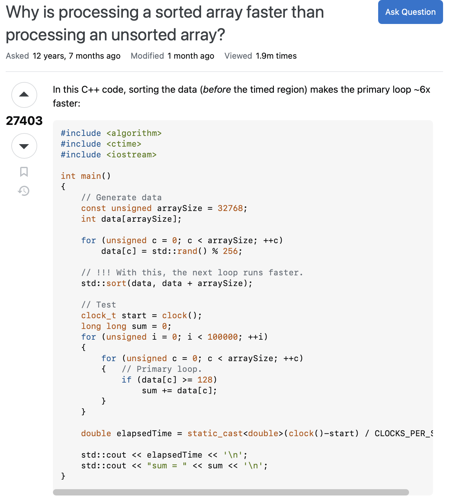
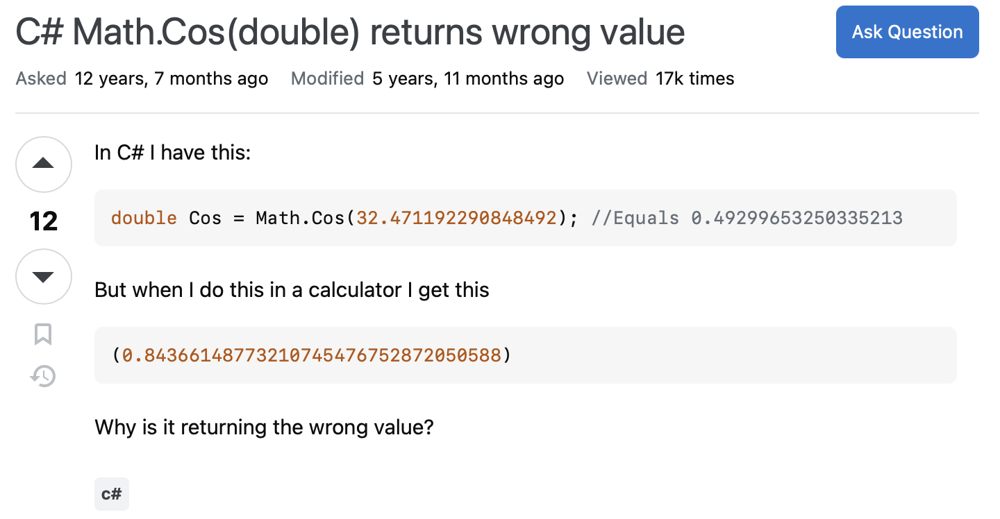

# Dont Ask Dumb Questions

## Introduction
In software engineering, asking the right questions is just as important as finding the right answers. A smart question will display effort, clarity, and detailed respect for the reader’s time, representing the backbone of effective communication and problem-solving. Eric S. Raymond’s *"How To Ask Questions The Smart Way"* guides readers on a method for crafting questions that can lead to significant and efficient solutions. This technical essay explores two opposing examples from Stack Overflow, where there is a smart question and a poorly constructed one. A smart question will meet Raymond’s criteria, while the opposite falls short, reflecting on the factors that make a question effective.

## A Smart Question: Why is processing a sorted array faster than processing an unsorted array?


[*"Why is processing a sorted array faster than processing an unsorted array?"*](https://stackoverflow.com/questions/11227809/why-is-processing-a-sorted-array-faster-than-processing-an-unsorted-array)


A great example of a smart question comes from a Stack Overflow post titled, **"Why is processing a sorted array faster than processing an unsorted array?"**. The poster learns there is a performance difference when processing sorted versus unsorted arrays, in C++. Instead of posting a simply stated general question, the poster explained behavioral observations, shared a reproducible code portion, and provided information regarding their system setup, like the compiler and hardware utilized.

Reviewing several of Raymond’s principles, this post aligns with:
1. **Be precise and informative about your problem**:
     A clear and specific description of the issue is provided, including steps with the code that are reproducible.
2. **Describe the goal, not the step**:
   The focus of this post was on understanding the reason behind the performance issue, rather than attempting to find a quick fix.
3. **Demonstrate prior research**:
   The system details and code that were included show that a significant amount of effort was put in before asking for help.
4. **Respect the community’s time**:
   This question was well-structured, ensuring ease for readers to reply and provide significant answers.

The post responses were detailed and insightful, with contributors discussing concepts like branch prediction and CPU cache optimization. Due to how this question was posted, this online conversation not only helped the asker but also created a valuable resource for the entire Stack Overflow community.

## A Poor Question: C# Math.Cos(double) returns wrong value


[*"C# Math.Cos(double) returns wrong value."*
](https://stackoverflow.com/questions/11166034/c-sharp-math-cosdouble-returns-wrong-value)

On the flip side, there’s the post titled, **"C# Math.Cos(double) returns wrong value."**. The asker posts, *"In C# I have this: `double Cos = Math.Cos(32.471192290848492); //Equals 0.49299653250335213`. But when I do this in a calculator I get `(0.84366148773210745476752872050588)`. Why is it returning the wrong value?"*.

Reviewing several of Raymond’s principles, this post violates:
1. **Lack of precision and informativeness**:
   This post fails to explain the discrepancy caused by using degrees in the calculator instead of radians in C#.
2. **No evidence of prior research**:
   This question does not indicate that the poster made any attempt to understand the issue before asking, such as reading the documentation for `Math.Cos`.
3. **Failure to describe the goal**:
   Instead of exploring the mechanics of trigonometric functions in programming, this post has a narrow focus on the unexpected output.
4. **Minimal context**:
   This asker does not explain their environment or the procedures taken to troubleshoot, leaving readers to assume and infer the basics.

The responses made to this post reflect the inefficiency caused by the poorly made question. Many replies specified the distinction between degrees versus radians, providing solutions such as:

```csharp
double angleInDegrees = 32.471192290848492;
double cos = Math.Cos(angleInDegrees * (Math.PI / 180.0));
Console.WriteLine(cos); // Correct value in radians
```

Even though the responses fixed the immediate issue, this question missed the chance to explore trigonometric functions in greater depth, limiting its value to the community and its readers.

## Comparable Lessons
Comparing these two examples showcases the significance of preparation and clarity in technical, online communication. The well-explained question about sorted arrays brought forth thoughtful and detailed responses that improved the community’s collective knowledge. In contrast, the poorly constructed `Math.Cos` question led to a superficial conversation that resolved the immediate issue but missed an opportunity for broader understanding.

Raymond’s principles highlight the value in maintaining meaningful engagement. Smart questions save time, attract collaborative problem-solving, and generate insights that benefit others. On the other hand, poorly framed questions waste the time of readers and often lead to less impactful answers.

## Insights
These examples reinforce why smart questions should be asked. It showcases that it is both a skill and a habit. It requires effort, preparation, and genuine respect for the time and expertise of those who may respond to provide insightful knowledge. By following the guidelines of Raymond’s principles, we can ensure our questions are clear, concise, and engaging. This will lead to a higher chance of receiving better outcomes, including better experiences for everyone involved. For software engineers, this methodical approach is crucial for professional growth, creating strong collaboration, and maintaining a strong foundation for the surrounding community.

## Conclusion
In conclusion, asking smart questions is a fundamental skill for software engineers. By providing thoughtful inquiries and considering Raymond’s guidelines, we can improve our problem-solving capabilities and contribute to a culture of respect and shared learning. The opposing examples provided from Stack Overflow demonstrate how important Raymond’s principles are, leading to more effective and meaningful interactions. If these principles are neglected, there is a higher chance of resulting in frustration and wasted effort in response. In the end, the approach to crafting questions shapes the quality of the answers we receive in return, and the depth of the connections we build.

## Artificial Intelligence
This essay was aided by the use of the AI tool ChatGPT, which was employed to enhance the structure and correct grammatical and spelling errors. The content of this technical essay, excluding referenced examples, is entirely my own. The AI provided support in organizing the material and improving readability. This collaborative approach ensured that the clarity and coherence of the essay were maintained while staying true to my original material.
