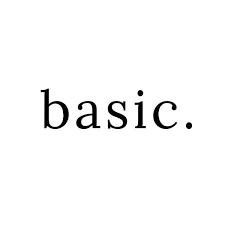
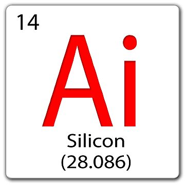

## Introduction 
When students at the University of Hawaii at Manoa, especially those in ICS or Computer Engineering, begin crafting résumés for internships, jobs, or scholarships, a common challenge they face is remembering the technical skills they've gained throughout their coursework. As deadlines approach, many students experience stress and uncertainty, struggling to recall whether they used React in ICS 314, wrote C code in ICS 212, or practiced agile methodologies in EE 491.  

Mākaukau is a web-based application designed to address this issue by helping UH Manoa students track and organize the skills they've developed across different classes. It allows users to log courses they’ve completed and tag them with relevant technologies and concepts, enabling them to easily generate a personalized “skill résumé” at any time. The application will be built using Next.js, React, Bootstrap 5, GitHub for project management, and Vercel for deployment, fully satisfying the technical requirements of the ICS 314 Final Project.

## The Issue 
Students at UH Manoa currently have no centralized system for tracking the technical skills they develop throughout their academic journey. Course descriptions often lack detail, and once a class is over, students rarely take the time to reflect on the specific tools or technologies they’ve learned. This becomes a real challenge when it’s time to apply for internships, update a LinkedIn profile, or prepare graduate school applications. While students may have gained experience with tools like TypeScript, Git, or Agile practices, there’s no structured way to document or revisit that knowledge.

## The Tissue 
Mākaukau offers a personalized approach to helping students manage and present their technical skills. After registering and logging in, users can look up UH Manoa courses they’ve completed and tag each one with the tools, technologies, or concepts they learned. These entries are saved to a private dashboard that continuously updates to reflect the student’s technical background. Users can filter their skills by category, review their entire portfolio, and export a customized résumé in Markdown or PDF format when needed. This tailored experience fulfills the “special sauce” requirement, as each user interacts with a unique dashboard based on their academic path. The project is designed specifically for the UH Manoa community, with a strong focus on ICS, Computer Engineering, and STEM students, ensuring it remains closely aligned with the local engagement goals of the ICS 314 final project.

## What's Good? 
Mākaukau will include several key pages to support its core functionality. The landing page will serve as an introduction to the platform and provide options for users to log in or register. Once authenticated, users will access a personalized dashboard where they can view and manage the courses they’ve added along with their associated skills. The platform will also include a page for adding new courses, allowing users to either search for existing UH classes or manually enter them, then tag relevant skills. A résumé page will generate a polished, filterable summary of their technical abilities, which can be exported for use in job applications. An optional admin section may be included to help manage skill tag suggestions and maintain course data.  

In addition to the core features, several enhancements are planned as stretch goals. These include smart skill tag suggestions based on community data, visual insights into skill trends over time, and anonymized peer comparisons such as “Top 5 skills tagged in ICS 314.”

## Apply To Apply 
This project benefits a wide range of students at UH. A first-year student can begin developing their skill portfolio from the start, making it easier to monitor their progress throughout each semester. For graduating seniors, the app provides a convenient way to compile and export a résumé showcasing the technical skills they've gained, which can be used for job or internship applications. Peer advisors or career counselors can also use the platform alongside students to identify skill gaps and offer guidance on areas to focus on for future growth.

## Dont Be Basic 
Although the core features of the minimum viable product (MVP) focus on tagging skills and generating résumés, our team has identified several additional features that could enhance the overall user experience. These potential improvements include intelligent skill suggestions based on patterns from other users, anonymized leaderboards highlighting the most commonly tagged skills for specific courses, privacy controls that allow users to choose who can view their portfolios, and UH email verification to confirm user identity and restrict access to the UH community. These enhancements aim to make the platform more user-friendly while fostering a collaborative, campus-wide tool that students can continue to benefit from throughout their academic journey.

## Wrapping It Up 
Mākaukau is more than just a résumé helper—it’s a tool built by students, for students, with the goal of making technical skill development more visible, organized, and empowering. By allowing users to actively track and reflect on what they’ve learned, the app helps bridge the gap between coursework and career readiness. Whether you're just getting started in ICS or preparing to graduate, Mākaukau can support your academic journey, give you confidence in your skills, and help you tell your story—one course at a time.

## The Man, The Myth, The Legend  
This project was collaboratively proposed and developed by Alexander Chang. All content, ideas, and technical directions were the result of group discussions and planning sessions. This essay reflects a shared vision of the problem and the collaborative design of the solution.

## Artificial Intelligence 
This essay was aided by the use of ChatGPT to assist in structuring content, refining grammar, and ensuring clarity in presentation. All ideas and descriptions were developed by the contributors. AI tools were used only for editing support to improve readability and professional tone.

