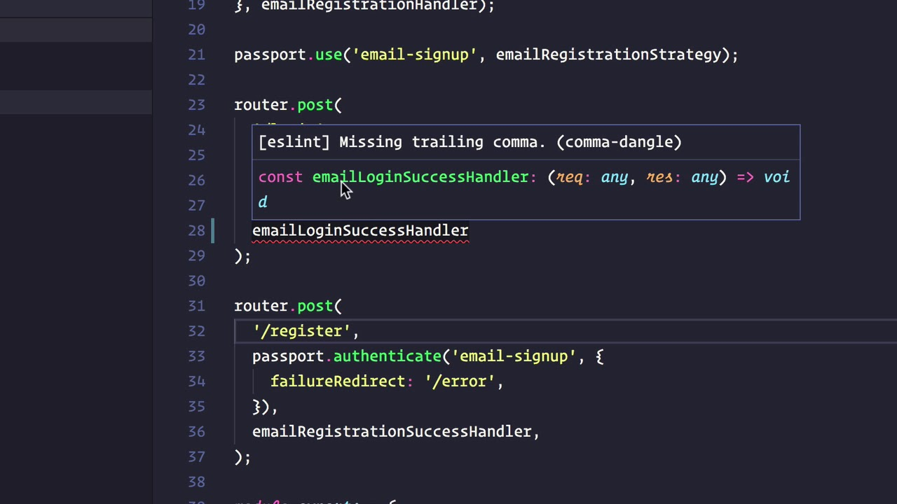

    
    

## Introduction 
When the term "coding standards" is mentioned, the first thoughts are usually formatting conventions such as tabs versus spaces, brace positioning, or whether to use semicolons in JavaScript. While these elements contribute to consistency, the significance of coding standards reaches far beyond aesthetics. They serve as a foundation for improving code readability, maintainability, and security.
Coding standards bridge the gap between personal coding styles and industry best practices. By ensuring uniformity across projects, coding standards help reduce errors, improve debugging efficiency, and make collaboration easier. They ultimately create a shared language that enables developers to work together seamlessly.

## Code for Role Play 
Adhering to coding standards provides a structured approach to mastering programming languages. These guidelines support best practices, allowing developers to minimize errors and write more efficient code. TypeScript’s strict typing rules, coupled with ESLint’s real-time feedback, help prevent common JavaScript errors, while Python’s PEP 8 fosters readability and idiomatic practices.
Learning and following coding standards from the start helps developers build positive habits that lead to cleaner and more maintainable codebases. Developers who internalize these practices early on tend to transition more smoothly into professional environments, where consistency and maintainability are critical.

## First Impressions 
The initial experience of applying ESLint within VSCode can be both eye-opening and demanding. At first, the sheer number of warnings and errors may seem intimidating, making it difficult to determine where to begin debugging. However, as time passes and familiarity grows, developers begin to appreciate ESLint’s structured feedback.
Over time, developers recognize that ESLint's alerts lead to cleaner and more readable code, reinforcing best practices that might otherwise be overlooked. ESLint encourages discipline by identifying issues before execution, allowing developers to refine their code incrementally. A simple example of how ESLint improves code quality can be seen below.

    
    

        <strong></strong>
    

    

        This image illustrates how ESLint seamlessly works with VSCode to enforce automatic code formatting while preserving consistent styling conventions. It highlights the effectiveness of ESLint’s auto-fix capabilities, going beyond merely detecting issues. By leveraging this feature, developers achieve a well-structured codebase with enhanced readability and maintainability, eliminating the need for manual adjustments.
    

    

## Code with Benefits 
The seamless combination of ESLint with VSCode offers multiple advantages. Immediate feedback ensures errors and inconsistencies are flagged in real time, reducing debugging efforts. Customizable rulesets allow developers to modify and tailor ESLint configurations to enforce team or project-based coding guidelines.
Additionally, ESLint automates code formatting, retaining a consistent style across programs. This ensures that even as projects grow, they remain readable and maintainable, reducing technical debt in the long run. Below is an example of ESLint flagging an issue in VSCode.

    
    

        <strong></strong>
    

    

      
      This image of Visual Studio Code demonstrates ESLint detecting an issue in a file. The warning <code>[eslint] Missing trailing comma. (comma-dangle)</code> notifies that the rule enforcing trailing commas is active. In return, the developer is prompted to insert a comma at the end of object or function parameters to ensure consistency. The highlighted text and tooltip showcase how ESLint delivers real-time feedback, assisting developers in writing clean and uniform code.

    

    

## Boosting Code 
Leveraging coding standards alongside tools like ESLint reduces errors and fosters better code structure. Maintaining consistency across codebases helps future-proof projects by enhancing scalability and adaptability. As software progresses, a well-defined standard aids developers in efficiently preserving and expanding projects without introducing inconsistencies.
Following coding standards ensures that software projects remain maintainable over time. This makes it easier for new developers to understand the code, contribute effectively, and reduce vulnerabilities while improving overall software quality. Well-structured and standardized code also simplifies onboarding for new team members, decreasing the learning curve and increasing productivity.

## Conclusion 
Although elements like indentation and brace placement may seem minor, coding standards have a significant impact on how software is written, reviewed, and maintained. Tools such as ESLint encourage best practices that lead to cleaner and more efficient code. By enforcing a unified coding style, coding standards accelerate collaboration, improve software quality, and make debugging more manageable.
Whether a beginner or an experienced programmer, adhering to coding standards is a crucial step toward producing reliable and efficient software solutions. Organizations that enforce these standards benefit from reduced development costs, fewer bugs, and enhanced software stability, proving that coding standards are an essential part of professional software engineering.

## Artificial Intelligence 
This essay was enhanced with the assistance of the AI tool ChatGPT, which was used to refine structure, correct grammatical errors, and improve consistency. With the exception of examples, the content remains entirely original. The AI’s role was limited to organizing the material and enhancing readability. This collaborative approach ensured that clarity and coherence were maintained while preserving the integrity of the original work.

