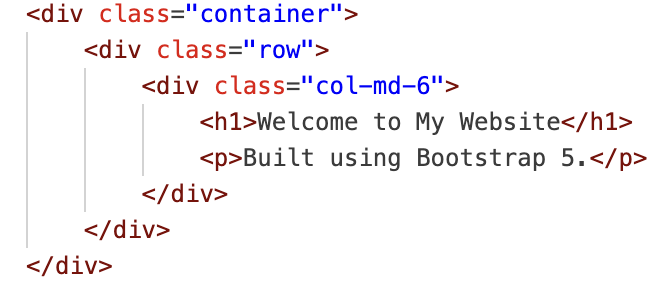
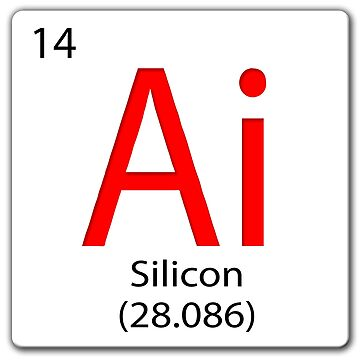

    
    

## The U+I Dilemma 
UI frameworks often give the impression of being an unnecessary layer of complexity, leading many software developers to question whether the rewards outweigh the effort. Raw HTML and CSS provide users with complete control over styling and layout, offering flexibility that some developers prefer. Even though there is a steep learning curve associated with UI frameworks, solutions like Bootstrap 5 offer significant advantages in development speed, consistency, and maintainability. 
Throughout this essay, the benefits of UI frameworks will be explored and compared with raw HTML and CSS, along with a personal perspective on the utilization of Bootstrap 5 and Semantic UI. The purpose of this discussion is to showcase the importance of investing in UI frameworks and explain why it is a strategic decision for modern web development.

## The Struggles of UI Development 
In UI development, designing a user-friendly, responsive, and visually appealing web page using only HTML and CSS can be an incredibly challenging task. While CSS is a powerful styling language, it lacks built-in tools for managing layouts, responsiveness, and consistency across different platforms. As a result, developers often need to write extensive custom code to implement even the most basic design elements expected by modern users.
UI frameworks simplify this process by providing pre-designed, well-tested components such as buttons, forms, and navigation bars. They also introduce structured grid systems, making it easier for developers to create and maintain responsive designs. Additionally, these frameworks help resolve browser inconsistencies, preventing developers from having to write extra code for compatibility across different browsers. Without a UI framework, these challenges must be handled manually, potentially becoming more tedious and error-prone.

## Bootstrap 5: The Swiss Army Knife of UI Design 
Bootstrap 5 is one of the most well-known UI frameworks due to its high versatility and ease of implementation. It also offers a comprehensive collection of pre-styled components that help speed up the development process. Compared to its predecessors, Bootstrap 5 is no longer dependent on jQuery, making it a more lightweight and modern framework.
Its most notable features include a utility-first design that reduces the need for custom CSS, an upgraded grid system that enhances responsiveness, and customizable variables that simplify styling. It also offers advanced accessibility improvements, such as refined focus states and ARIA attributes. Due to these features, Bootstrap 5 is an extremely valuable tool for developers at all levels.

## Bootstrap vs. Semantic UI 
While Bootstrap is considered an industry standard, it is not the only option available. Semantic UI offers a different approach by prioritizing readability with a more human-friendly class naming system. Compared to Bootstrap, which is a more utility-based, mobile-first platform, Semantic UI utilizes intuitive class names for easier code readability and understanding.

One of the key differences between these frameworks is their grid systems. Bootstrap 5 employs a flexbox-based grid, while Semantic UI has a custom grid system with its own set of rules. Another significant difference lies in customization. Bootstrap relies on SCSS variables and utility classes, whereas Semantic UI offers an extensive theming system with built-in configuration features.

From personal experience, Semantic UI seems more intuitive since it has natural language class names, such as `ui button` compared to Bootstrap’s `btn btn-primary`. However, Bootstrap includes comprehensive documentation with broad community support. Additionally, it is an industry-wide standard, making it the more practical choice for real-world projects requiring scalability and long-term maintainability.

## UI Frameworks vs. The Bare-Bones Approach 
Some developers prefer to completely avoid UI frameworks, arguing that they add unnecessary bloat and restrict design flexibility. Although this is a valid concern in certain situations, the benefits of UI frameworks often outweigh the drawbacks, especially for larger projects. These frameworks significantly reduce development time by providing pre-built, reusable components while ensuring a consistent aesthetic and user experience across an application.

UI frameworks also enhance scalability, aiding development teams in managing and expanding their projects efficiently. While manually coding HTML and CSS may be sufficient for simpler projects, increasing complexity makes UI frameworks more beneficial. They allow developers to focus on essential functionality rather than spending excessive time refining styles and configuring layouts.

## Seeing Is Believing: UI Frameworks in Action 
A web page built without a UI framework requires custom CSS for each element, manually designed layouts, and extra effort to achieve responsiveness. In contrast, a web page created with Bootstrap 5 takes advantage of structured grid systems, pre-styled components, and built-in responsive design, simplifying the development process.
For example, consider a simple Bootstrap layout:

    
    

        <strong></strong>
    

    

        This layout automatically adapts to different screen sizes, whereas a custom CSS approach would require additional effort, including manually setting breakpoints and writing media queries.

    

    

## Conclusion: Why UI Frameworks Are Worth It 
In conclusion, UI frameworks like Bootstrap 5 greatly simplify the web development process by enhancing speed, consistency, and scalability. Even though they require an initial learning curve, the long-term advantages of increased efficiency, ease of maintenance, and improved responsiveness make them essential tools for modern developers. By utilizing these frameworks, developers can focus on the core functionality of their applications instead of spending unnecessary time on repetitive styling and layout adjustments.
Furthermore, UI frameworks enhance user experience by ensuring that web applications are visually appealing, easily accessible, and fully responsive across various devices. Whether using Bootstrap, Semantic UI, or another framework, incorporating these tools improves both workflow efficiency and the final product. Adopting UI frameworks enables developers to build modern, high-quality applications that follow industry standards and meet user expectations.

## Artificial Intelligence 
This essay was aided by the use of AI tools, including ChatGPT, to enhance structure, refine readability, and correct grammatical inconsistencies. The technical content, insights, and personal experiences remain entirely my own. AI assistance was employed to organize material effectively while maintaining clarity and coherence, ensuring that the final product reflects my understanding and perspective on UI frameworks in modern web development.
