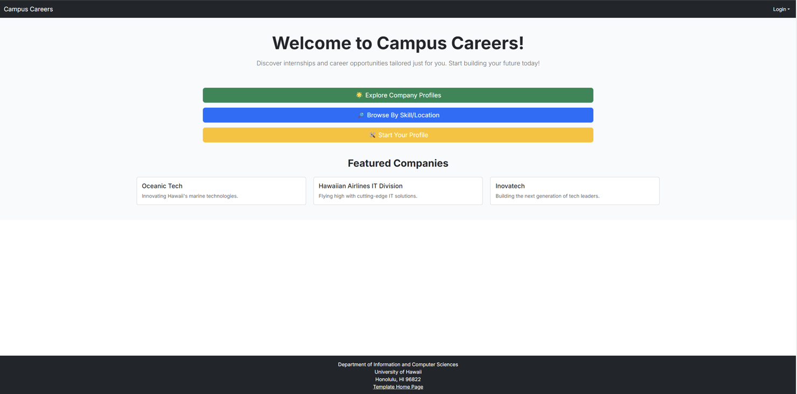

### **Project Overview:**
Campus Careers is a web application developed to help students at the University of Hawaii find internship and job opportunities. The goal of the project was to build a comprehensive platform that connects students with potential employers, while also providing administrative tools for managing job listings.

**Objective:**
- Develop a platform to connect students with career opportunities.
- Facilitate easy job listing management for admins.
- Provide a secure and user-friendly interface for students and recruiters.

---

### **Your Contributions:**

#### **1. Collaborative Development:**
- Worked closely with teammates to plan and implement features, ensuring smooth collaboration throughout the development process.
- Assisted teammates in debugging and resolving errors related to frontend components and backend integration.
- Conducted code reviews and paired programming sessions to maintain consistent coding standards across the project.

#### **2. Project Management and GitHub Workflow:**
- Managed the **GitHub project page**, organizing tasks, workload distribution, and tracking progress.
- Created **GitHub issues** and **project boards** to assign tasks, ensuring even distribution of work among team members.
- Defined **modules** for different features and established **issue branches** to maintain a clear workflow.
- Facilitated collaboration by managing **pull requests**, merging changes, and resolving conflicts efficiently.
- Used **GitHub Projects** to track task completion and provide updates during team meetings.

#### **3. Frontend Development:**
- Designed and implemented the user interface using **Next.js**, focusing on responsive and user-friendly layouts.
- Developed interactive components such as the **Job Listings page** and **Application Forms**, ensuring a smooth user experience.
- Utilized **Tailwind CSS** for consistent styling across devices.
- Built the **Admin Dashboard**, enabling authorized users to manage job postings and view applicant data.

#### **4. Backend and Database Integration:**
- Set up the **database schema** using **Prisma**, defining models for users, job listings, applications, and admin roles.
- Integrated **Supabase** as the PostgreSQL backend, ensuring data persistence and security.
- Established a secure and reliable connection between **Vercel** and **Supabase**, managing environment variables and database credentials.
- Optimized the database for quick data retrieval and seamless integration with the frontend.

#### **5. Deployment and Hosting:**
- Set up the project deployment using **Vercel**, ensuring that the application was continuously available and easily accessible.
- Managed environment variables and API keys securely to maintain stable connections between the frontend and backend services.
- Collaborated with teammates to troubleshoot deployment issues and ensure the application functioned correctly in a live environment.

#### **6. Authentication and User Management:**
- Implemented secure authentication using **NextAuth.js**, allowing users to sign in using university credentials.
- Configured **session management** to ensure a smooth and secure user experience, including login/logout functionalities.
- Set up **role-based access control** for students and admins, restricting dashboard functionalities to authorized personnel.

#### **7. Automated Testing:**
- Implemented **Playwright testing** directly within **GitHub Actions** to ensure stable and reliable testing automation.
- Wrote **acceptance tests** to verify key functionalities:
  - User login and registration.
  - Job application submission.
  - Admin dashboard access and job management.
- Automated test execution on every commit, maintaining code quality throughout the development cycle.

---

### **Skills Demonstrated:**
- **Full-Stack Development:** Combined frontend, backend, and database components seamlessly.
- **Deployment and CI/CD:** Managed stable application deployment on **Vercel** and automated testing with **GitHub Actions**.
- **Team Collaboration:** Managed tasks, modules, and branches efficiently using **GitHub Projects**.
- **Project Organization:** Distributed workload effectively among team members, ensuring balanced progress.
- **Problem Solving:** Debugged and resolved issues related to authentication, database connections, and deployment.

---

### **Screenshots:**

#### **1. Landing Page 

#### **2. Login / Signup Page

#### **3. Student Home Page

#### **4. Company Listing Page 

#### **5. Browse Skill / Location Page

#### **6. Create Company Page

#### **7. Admin Edit Page

---

### ** Links:**
- [Campus Careers Organization Page](https://campus-careers.github.io/)
- [Campus Careers GitHub Repository](https://github.com/jang-taeyang/campus-careers)

---

### **Conclusion:**
Working on Campus Careers provided invaluable experience in full-stack web development, including building responsive interfaces, integrating secure authentication, and managing a robust backend. Through automated testing and continuous integration, I maintained code quality while efficiently managing the development process.
